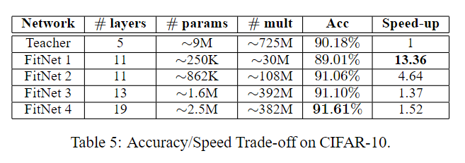

# 对于蒸馏的个人理解

## 摘要

最近在参加 low-level 任务比赛，由于赛事主办方对于模型大小有严格要求（小于5M），所以临时抱佛脚，看了些关于蒸馏的内容。
期望通过蒸馏的方式，将大模型的知识迁移到小模型上，从而达到小模型的效果和大模型的效果相近的目的。
由于时间有限，所以只是简单的了解了一下蒸馏的基本思想和方法，这里记录一下。可能存在问题。

## 蒸馏的基本思想

模型压缩和加速四个技术是设计高效小型网络、剪枝、量化和蒸馏。蒸馏，全名是知识蒸馏，其主要目的是将 teacher model (一般参数量较大)的知识迁移到 student model (一般参数量较小)上，从而达到小模型的效果和大模型的效果相近的目的。
而这里的知识，一般指 teacher model 的输出，即 logits，也有方法将知识指做模型中间层的特征。

当前蒸馏已经针对不同的任务，做了不同的方法。例如，分类中，会使用预测层的 logits；而在检测中，会使用模型中间层的特征，或者关注于the most salient regions of the channel-wise maps, presumably corresponding to the most useful signals for semantic segmentation.（CWD文章）。这里主要介绍分类中的蒸馏方法。

## Hinton 开篇工作

开篇工作是2014年Hinton大佬的文章Hinton G, Vinyals O, Dean J. Distilling the Knowledge in a Neural Network NIPSW 2014。


从网络结构图上能看出来，模型在预测层后，使用不同 Temperature 的 softmax ，得到不同的 logits 。
学生网络的 soft predictions 要与老师网络的 soft labels ，计算 KL 散度 loss ，保持分布相似。而且学生网络的 hard predictions 要与 gt 计算 CE loss 。
这两个 loss 按照一定权重融合，进行网络训练。
比较细节的地方在于， softmax 中有个“ T ”参数，用于控制网络针对不同类别的输出的结果。目测 soft labels 中 T 取大于 1 ，是为了让分布不集中于预测置信度最大的类别，让预测出的分布更加平缓。


文章中还有一些比较有意思的结论：
* 使用10个模型来生成 soft target ，相比较只使用一个，效果更好。
* Soft target 训练出的模型泛化能力更强，不易过拟合。

### Hinton开篇之作，后续的方向

后续工作主要是针对开篇工作的不足，进行改进。包括：可以不仅限于预测层的 logits，还可以使用模型中间层的特征；可以不仅限于 KL 散度 loss 和 CE loss；结合任务特性，例如分割中，对应类别的激活肯定更大。

## FitNets

FitNets: Hints for Thin Deep Nets

Hinton 开篇工作是使用最后输出的 logits 作为蒸馏目标。而 FitNets 论文主要有以下贡献：

* 使用网络中间提取的特征作为蒸馏目标，而不是最后的 logits 。
* 为了应对teacher model 和 student model 的 channel 数量不同，使用了 connect layer （看代码里是1*1卷积+bn+relu） ，将 teacher model 中间层的特征映射到 student model 中间层的特征上。
* 特征对齐的loss有多种选择，一般有 L2 loss 和 KL loss。源码中 KL loss 会用在 fc 层， L2 loss 用在 conv 层。
* 原文中student model 在蒸馏后，精度超越了 teacher model 。作者认为是因为 student model 有更多的层，所以能够学到更多的知识。



### FitNets 代码简单分析

代码来源于mmrazor框架，主要对配置文件进行分析。
不重要的配置部分删去，只保留重要的部分。

#### 网络结构部分
```python
model = dict(
    _scope_='mmrazor',
    type='SingleTeacherDistill',
    data_preprocessor=dict(
        ...),
    # teacher model为resnet50
    # student model为resnet18
    # 个人认为，teacher和student不一定要使用一个网络，例如teacher使用resnet50，student使用mobilenetv2
    # 笔者认为，不使用同一个网络，需要注意 connect layer 的激活函数要和 teacher model 中间层的激活函数一致.
    architecture=dict(
        cfg_path='mmcls::resnet/resnet18_8xb32_in1k.py', pretrained=False),
    teacher=dict(
        cfg_path='mmcls::resnet/resnet50_8xb32_in1k.py', pretrained=True),
    # 加载预训练模型
    teacher_ckpt=teacher_ckpt,
    distiller=dict(
        type='ConfigurableDistiller',
        student_recorders=dict(
            # 选择layer4和3，目测使用较浅的输出层意义不大，要选略深的层
            bb_s4=dict(type='ModuleOutputs', source='backbone.layer4.1.relu'),
            bb_s3=dict(type='ModuleOutputs', source='backbone.layer3.1.relu'),
            fc=dict(type='ModuleOutputs', source='head.fc')),
        teacher_recorders=dict(
            bb_s4=dict(type='ModuleOutputs', source='backbone.layer4.2.relu'),
            bb_s3=dict(type='ModuleOutputs', source='backbone.layer3.5.relu'),
            fc=dict(type='ModuleOutputs', source='head.fc')),
        distill_losses=dict(
            loss_s4=dict(type='L2Loss', loss_weight=10),
            loss_s3=dict(type='L2Loss', loss_weight=10),
            loss_kl=dict(
                type='KLDivergence', tau=6, loss_weight=10, reduction='mean')),
        # connectors层的配置
        connectors=dict(
            loss_s4_sfeat=dict(
                type='ConvModuleConnector',
                in_channel=512,
                out_channel=2048,
                norm_cfg=dict(type='BN')),
            loss_s3_sfeat=dict(
                type='ConvModuleConnector',
                in_channel=256,
                out_channel=1024,
                norm_cfg=dict(type='BN'))),
        loss_forward_mappings=dict(
            loss_s4=dict(
                s_feature=dict(
                    from_student=True,
                    recorder='bb_s4',
                    record_idx=1,
                    connector='loss_s4_sfeat'),
                t_feature=dict(
                    from_student=False, recorder='bb_s4', record_idx=2)),
            loss_s3=dict(
                s_feature=dict(
                    from_student=True,
                    recorder='bb_s3',
                    record_idx=1,
                    connector='loss_s3_sfeat'),
                t_feature=dict(
                    from_student=False, recorder='bb_s3', record_idx=2)),
            loss_kl=dict(
                preds_S=dict(from_student=True, recorder='fc'),
                preds_T=dict(from_student=False, recorder='fc')))))
```

### 待补充
当前仍在将 FitNets 用来打比赛，如后续有一些新的发现，会补充在这里。


## Reference
* [知乎：从入门到放弃：深度学习中的模型蒸馏技术](https://zhuanlan.zhihu.com/p/93287223)
* [OpenMMLab MMRazor](https://github.com/open-mmlab/mmrazor)
* [CWD: Channel-wise Knowledge Distillation for Dense Prediction](https://arxiv.org/abs/2011.13256)
* [Distilling the Knowledge in a Neural Network论文笔记](https://zhuanlan.zhihu.com/p/621044759)