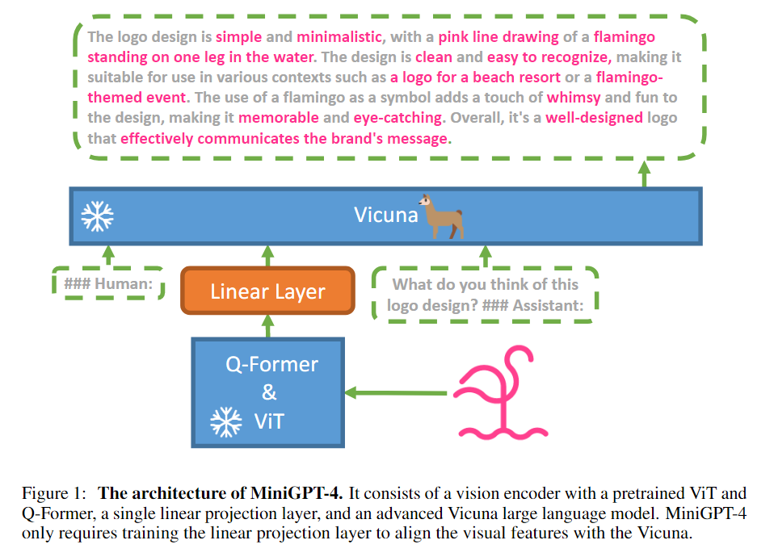

# miniGPT4

## 核心创新点

* 效果与GPT-4接近。（但我认为效果还差很远）
* 直接利用训练好的视觉模型 Encoder 和训练好的 LLM 组合，仅训练中间的连接层，就能完成图像生成文本的任务。提升多模态任务效果、降低训练成本。
* 指出了高质量数据的重要性。第二阶段使用人工标注的高质量数据进行训练，效果提升明显。
* 即使仅有少量的高质量微调数据，但网络展现出了很多其他的能力，例如：看图编故事、教做菜等。

## 方法篇

* 可以看到，VIT&QFormer是视觉模型，Vicuna是语言模型。两者使用训练好的模型进行进行初始化。仅训练中间的连接层。
* VIT&QFormer 直接使用了BLIP-2的模型。
* 语言模型使用的是Vicuna。后续LLaVA也用了这个模型。

训练共有两阶段。第一阶段使用大量图像文本对进行训练，让LLM能够理解图像。第二阶段使用高质量数据（经过设计的对话模板）进行训练，提升生成可信度和可用度。

### 第一阶段

* 使用Conceptual Caption, SBU and LAION 数据集。
* 使用 batch size 为 256，有500万数据，使用4个A100(80G) 训练10小时完成。
* 第一阶段训练完成的结果，不连贯、碎片化、易重复。所以需要第二阶段训练，以提高模型可用性。

### 第二阶段数据生成

* 使用第一步训练好的模型，结合特定的prompt，让模型生成更详细的图像描述。
* 为了找出不完整的prompt，检查是否到了80个token，不到的话使用Prompt：continue让模型继续生成。
* 使用ChatGPT微调上一步的生成的图像描述结果。
* 人工筛选结果。人工微调结果。
* 最终获得3500个数据。

### 第二阶段训练

使用这3500条数据进行微调。batch size为12，在单个A100上仅需7分钟就能完成训练。

## 评估

从论文中可以看到，没有给出具体的评价指标。仅通过展示了大量的生成结果来说明效果。所以缺乏一定的说服力。

## 其他

* BLIP-2中，作者使用OPT(decoder only)模型与FlanT5(encoder decoder)模型进行了对比。而MiniGPT4中，作者使用的是Vicuna(decoder only)，后续文章基本也都只使用了decoder only。个人认为，这说明NLP中对于decoder only的架构研究更多，更多人follow，有更好的效果，而在多模态中直接使用decoder-only同样也能带来更好的效果。所以后续的MLLM研究基本也沿用了decoder only的语言模型。

## 局限

该文章更像是个占坑的文章，很多方面做的不足。
* 评估上缺少定量指标。例如 BLIP-2 中展示了 VQA、GQA 等任务的结果，这篇论文中没有。哪怕自己定义一个指标，来对比一下，也是可以的。
* 缺乏更多的对比实验。既然该文章很多做法 follow 了 BLIP-2，那么是否可以在 BLIP-2 的基础上进行更多的对比实验，来验证该方法的有效性。例如把相同问题的回答结果，与 blip-2 进行对比？

文章提到的局限性：
* 幻觉问题。文中提到，并举例，MLLM同样会有大语言模型的推理不可靠、幻觉问题。
* 感知能力不足。文章中提到，缺乏对齐数据。Q-former可能丢失基本特征。投影层可能没有足够的能力。

## 运行效果

运行效果就不展示了，之前跑过这个模型，效果一般。就不再搭建环境再跑。